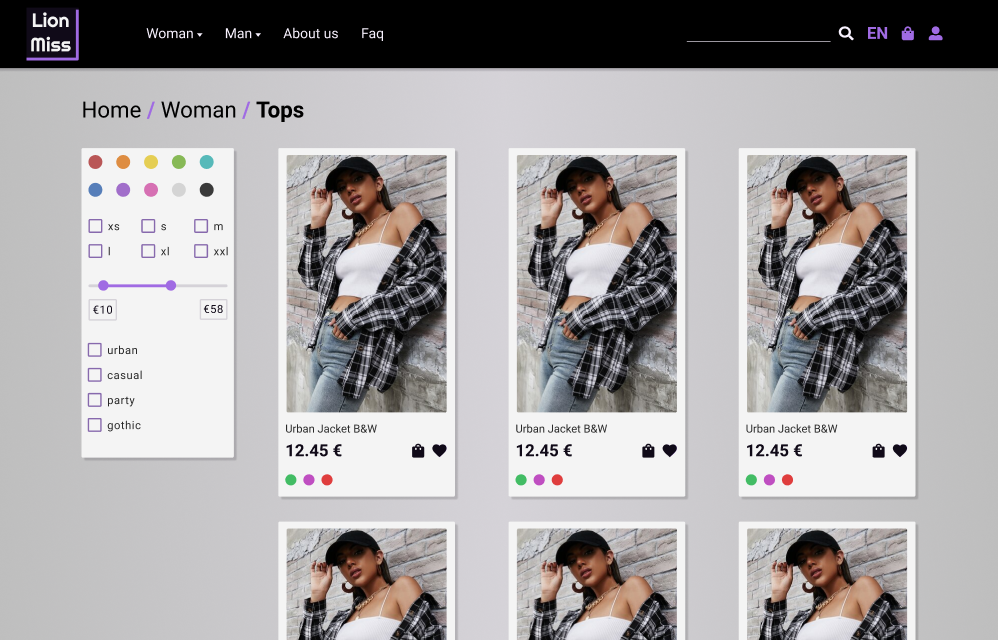
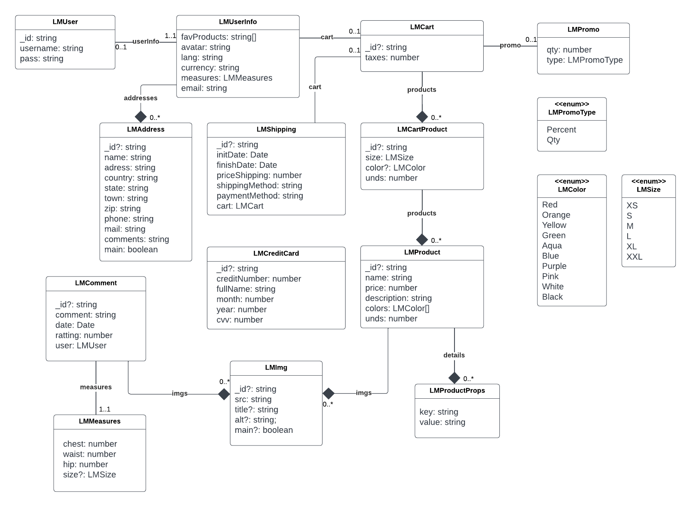

  

[💃 Personal Page](https://www.kodeneko.com) | [🐱 Github](https://github.com/kode-neko) | [🐤 Twitter](https://twitter.com/KodenekoFront) | [⚡ StackBlitz](https://stackblitz.com/@kode-neko) | [🧊 Codepen](https://codepen.io/kodeneko) | [🎨 Figma](https://www.figma.com/@kodeneko) | [✉️ Contact Mail](mailto:ladysun.freedom@gmail.com)

LionMiss is an unreal online shop about fashion 🛒 This is a "hub" project that gather several demos related to the project. We have a Swaggerm GraphQL editor and Storybook visor. All of them are examples of back and front works. Bellow there is an UML diagram to get an overall about business logic. This project may change every now and then, so you can be surprised in the next visit. Enjoy and send me recommendations through my social media and mail 😀

# Demos
- [🛍️ Hub](https://www.kodeneko.com/lionmiss)
- [🌳 Back | Swagger](https://www.kodeneko.com/lionmiss/swagger)
- [❄️ Back | GraphQL](https://www.kodeneko.com/lionmiss/gql)
- [🐱 Front | Github](https://github.com/kode-neko/lionmiss-components)
- [🐱 Core | Github](https://github.com/kode-neko/lionmiss-core)
- [🎨 Front | Storybook](https://www.kodeneko.com/lionmiss/storybook)
- [✏️ UI | Wireframe](https://www.figma.com/community/file/1238958453760498467)
- [📱 UI | Mockup](https://www.figma.com/file/eMCJmV0tmbeMoa8QZ8zQfY/Lionmiss-Mockup-(Community)?type=design&node-id=0%3A1&t=4WDOphYe2nRbgRqL-1)

 

# UML

